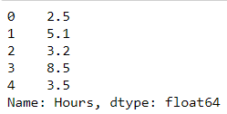

# Implementation-of-Linear-Regression-Using-Gradient-Descent

## AIM:
To write a program to implement the linear regression using gradient descent.

## Equipments Required:
1. Hardware – PCs
2. Anaconda – Python 3.7 Installation / Moodle-Code Runner

## Algorithm
1. Import the standard libraries in python required for finding Gradient Design.
2. Read the dataset file and check any null value using .isnull() method.
3. Declare the default variables with respective values for linear regression.
4. Calculate the loss using Mean Square Error.
5. Predict the value of y.
6. Plot the graph respect to hours and scores using .scatterplot() method for Linear Regression.
7. Plot the graph respect to loss and iterations using .plot() method for Gradient Descent.
## Program:
```
/*
Program to implement the linear regression using gradient descent.
Developed by: SRIJITH R
RegisterNumber: 212221240054 
*/
import pandas as pd
import numpy as np
import matplotlib.pyplot as plt
from sklearn.linear_model import LinearRegression
df=pd.read_csv('student_scores - student_scores.csv')
df.head()
df.tail()

#checking for null values in dataset
df.isnull().sum()

#To calculate Gradient decent and Linear Descent
x=df.Hours
x.head()

y=df.Scores
y.head()

n=len(x)
m=0
c=0
L=0.001
loss=[]
for i in range(10000):
    ypred = m*x + c
    MSE = (1/n) * sum((ypred - y)*2)
    dm = (2/n) * sum(x*(ypred-y))
    dc = (2/n) * sum(ypred-y)
    c = c-L*dc
    m = m-L*dm
    loss.append(MSE)
print(m,c)

#plotting Linear Regression graph
y_pred=m*x+c
plt.scatter(x,y,color="violet")
plt.plot(x,y_pred,color="purple")
plt.xlabel("Study Hours")
plt.ylabel("Scores")
plt.title("Study hours vs Scores")
plt.show()

#plotting Gradient Descent graph
plt.plot(loss, color="skyblue")
plt.xlabel("Iterations")
plt.ylabel("Loss")
plt.show()
```

## Output:
## Contents in the data file (head, tail):


## Checking for null values in the dataset:

# X and Y datasets from original dataset:


## Linear Regression Graph:

## Gradient Descent Graph:


## Result:
Thus the program to implement the linear regression using gradient descent is written and verified using python programming.
